# TypeWhisper for Mac

[](https://www.gnu.org/licenses/gpl-3.0)
[](https://www.apple.com/macos/)
[](https://swift.org)

Speech-to-text and AI text processing for macOS. Transcribe audio using on-device AI models or cloud APIs (Groq, OpenAI), then process the result with custom LLM prompts. Your voice data stays on your Mac with local models - or use cloud APIs for faster processing.

TypeWhisper `1.2` is the current stable direct-download release for macOS. It includes system-wide dictation, file transcription, prompt processing, rules, history, dictionary, snippets, and bundled integrations. Advanced surfaces like the HTTP API, CLI, widgets, watch folders, and the plugin SDK remain supported for power users and automation.

See the [release readiness guide](docs/release-readiness.md), [support matrix](docs/support-matrix.md), and [release checklist](docs/release-checklist.md) for the current release definition and ship gates.

<p align="center">
  <video src="https://github.com/user-attachments/assets/22fe922d-4a4c-47d1-805e-684a148ebd03" autoplay loop muted playsinline width="270"></video>
</p>

## Screenshots

<p align="center">
  <a href=".github/screenshots/home.png">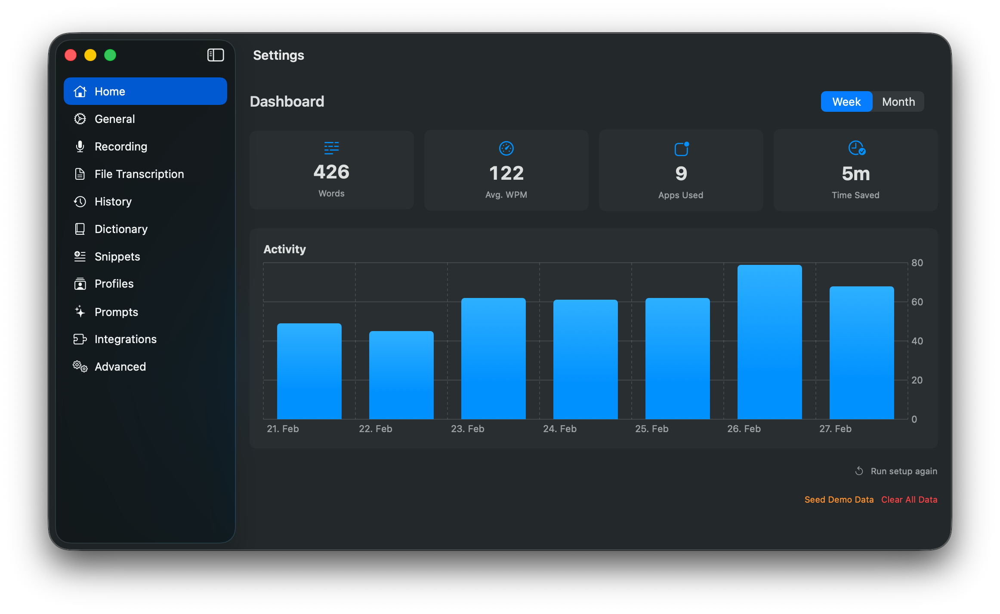</a>
  <a href=".github/screenshots/recording.png">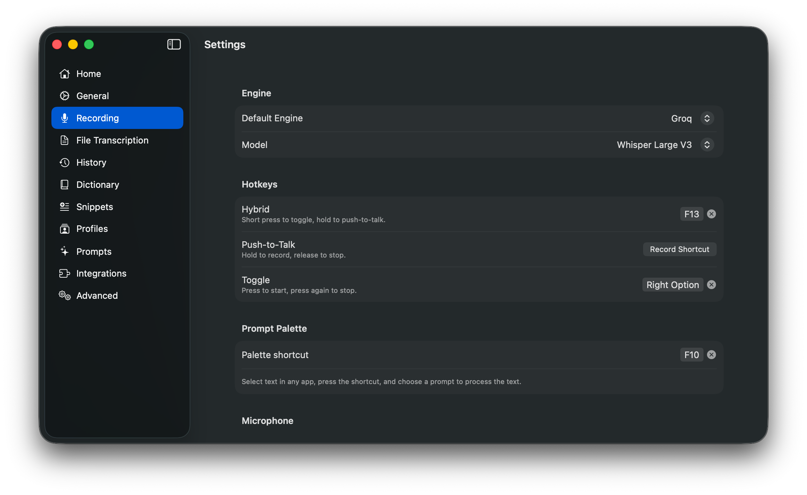</a>
  <a href=".github/screenshots/prompts.png">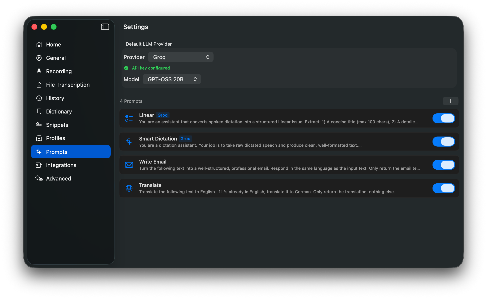</a>
</p>

<p align="center">
  <a href=".github/screenshots/history.png">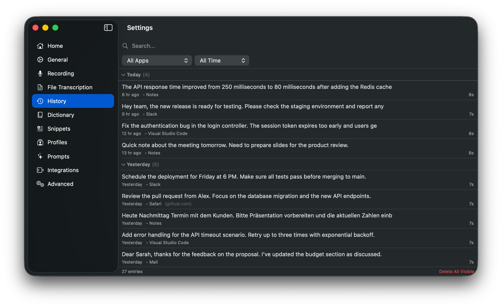</a>
  <a href=".github/screenshots/dictionary.png">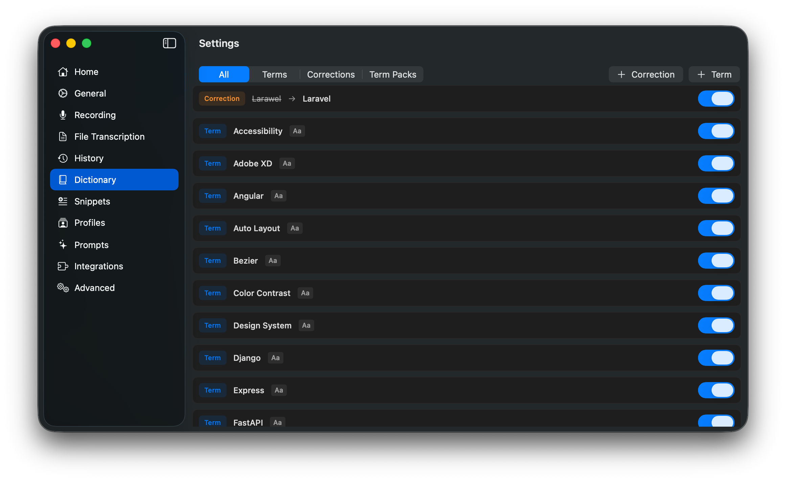</a>
  <a href=".github/screenshots/profiles.png">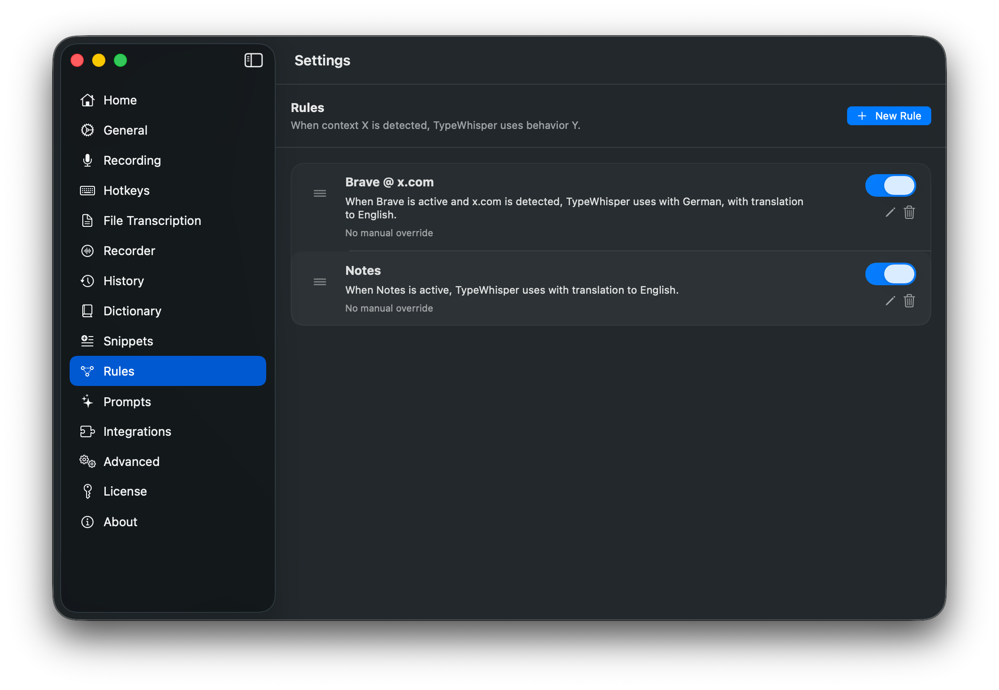</a>
</p>

<p align="center">
  <a href=".github/screenshots/general.png">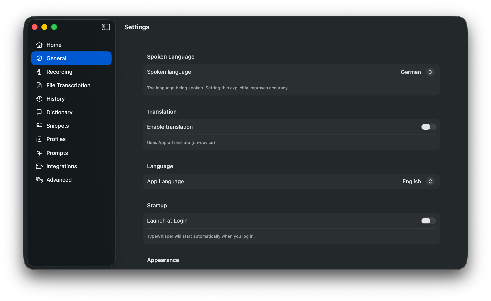</a>
  <a href=".github/screenshots/plugins.png">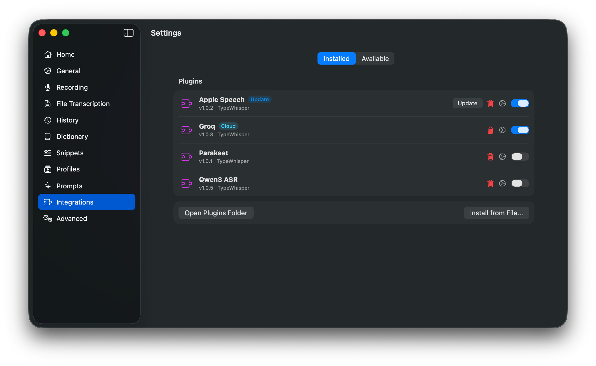</a>
  <a href=".github/screenshots/file-transcription.png">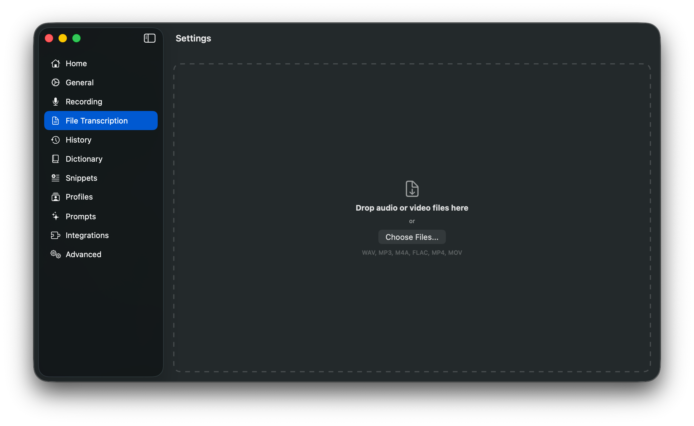</a>
</p>

<p align="center">
  <a href=".github/screenshots/snippets.png">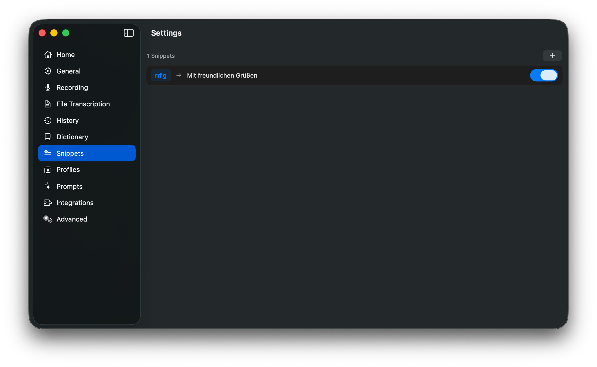</a>
  <a href=".github/screenshots/advanced.png">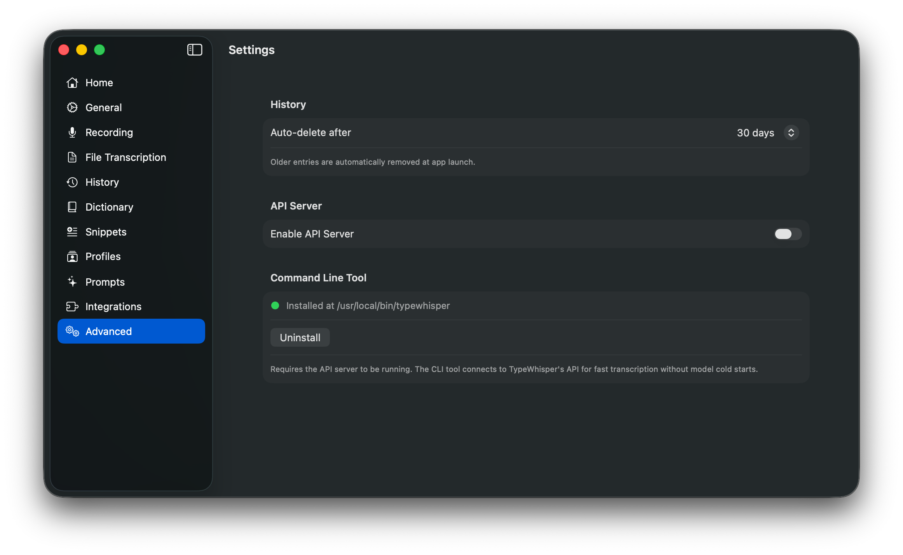</a>
</p>

## What's New in 1.2

- **Minimal indicator** - A compact power-user status view alongside the existing Notch and Overlay styles
- **Transcript preview toggle** - Live preview can now be disabled for Notch and Overlay indicators
- **Faster dictation start** - Metadata capture and URL resolution move off the critical start path
- **Short-clip improvements** - Better handling for brief utterances, especially with streaming preview and Parakeet
- **Audio recovery fixes** - More resilient recording and preview after device switches, AirPods profile changes, and `AVAudioEngine` reconfiguration
- **MLX plugin setup** - Qwen3, Granite, and Voxtral now support an optional HuggingFace token in settings for higher download limits
- **Localized term packs** - Built-in term pack metadata now renders in English and German

## Features

### Transcription

- **Nine engines** - WhisperKit (99+ languages, streaming, translation), Parakeet TDT v3 (25 European languages, extremely fast), Apple SpeechAnalyzer (macOS 26+, no model download needed), Granite Speech (MLX-based), Qwen3 ASR (MLX-based), Voxtral (local Voxtral Mini 4B, MLX-based), Groq Whisper, OpenAI Whisper, and OpenAI Compatible (any OpenAI-compatible API)
- **On-device or cloud** - All processing happens locally on your Mac, or use Groq/OpenAI Whisper APIs for faster processing
- **Streaming preview** - See partial transcription in real-time while speaking (WhisperKit)
- **Short-clip handling** - Better retention of brief utterances and fewer false no-speech discards
- **File transcription** - Batch-process multiple audio/video files with drag & drop
- **Subtitle export** - Export transcriptions as SRT or WebVTT with timestamps

### Dictation

- **System-wide** - Push-to-talk, toggle, or hybrid mode via global hotkey, auto-pastes into any app
- **Modifier-key hotkeys** - Use a single modifier key (Command, Shift, Option, Control) as your hotkey
- **Indicator styles** - Choose Notch, Overlay, or Minimal, with optional live transcript preview where supported
- **Sound feedback** - Audio cues for recording start, transcription success, and errors
- **Microphone selection** - Choose a specific input device with live preview and improved recovery after route changes

### AI Processing

- **Custom prompts** - Process transcriptions (or any text) with LLM prompts. 8 presets included (Translate, Formal, Summarize, Fix Grammar, Email, List, Shorter, Explain). Standalone Prompt Palette via global hotkey - a floating panel for AI text processing independent of dictation
- **LLM providers** - Apple Intelligence (macOS 26+), Groq, OpenAI / ChatGPT, Gemini, and OpenAI Compatible with per-prompt provider and model override
- **Translation** - Translate transcriptions on-device using Apple Translate

### Personalization

- **Rules** - Per-app and per-website overrides for language, task, engine, prompt, hotkey, and auto-submit. Match by app (bundle ID) and/or domain with subdomain support
- **Dictionary** - Terms improve cloud recognition accuracy. Corrections fix common transcription mistakes automatically. Auto-learns from manual corrections. Includes importable term packs
- **Localized term packs** - Built-in term pack names and descriptions are localized in English and German
- **Snippets** - Text shortcuts with trigger/replacement. Supports placeholders like `{{DATE}}`, `{{TIME}}`, and `{{CLIPBOARD}}`
- **History** - Searchable transcription history with inline editing, correction detection, app context tracking, timeline grouping, filters, bulk delete, multi-select export, auto-retention, and a standalone window accessible from the tray menu

### Integration & Extensibility

- **Plugin system** - Extend TypeWhisper with custom LLM providers, transcription engines, post-processors, and action plugins. Granite, Groq, OpenAI / ChatGPT, OpenAI Compatible, Gemini, Linear, Qwen3, Voxtral, and Webhook ship as bundled plugins, alongside the local engine plugins. Linear plugin enables voice-to-issue creation. See [Plugins/README.md](Plugins/README.md)
- **MLX download controls** - Bundled Qwen3, Granite, and Voxtral plugins support an optional HuggingFace token for higher rate limits and clearer download errors
- **HTTP API** - Local REST API for integration with external tools and scripts
- **CLI tool** - Shell-friendly transcription via the command line
- **Discord claim service** - Optional external service for Polar supporter and GitHub Sponsors Discord role claims

### General

- **Home dashboard** - Usage statistics, activity chart, and onboarding tutorial
- **Auto-update** - Built-in updates via Sparkle with stable, release-candidate, and daily channels
- **Universal binary** - Runs natively on Apple Silicon and Intel Macs
- **Widgets** - Desktop widgets for usage stats, last transcription, activity chart, and transcription history
- **Multilingual UI** - English and German
- **Launch at Login** - Start automatically with macOS

## Install

### Homebrew

```bash
brew install --cask typewhisper/tap/typewhisper
```

### Direct Download

Download the latest DMG from [GitHub Releases](https://github.com/TypeWhisper/typewhisper-mac/releases/latest).

Stable direct-download releases use the default Sparkle channel. Release candidates such as `1.2.0-rc*` and daily builds are published as GitHub prereleases, update the shared Sparkle appcast on their own channels, and are excluded from Homebrew.
Installed builds can switch channels in `Settings -> About` via the `Update Channel` picker.

## Quick Start

1. Install TypeWhisper from Homebrew or the latest DMG.
2. Open Settings and grant Microphone plus Accessibility access.
3. Pick an engine and, if needed, download a local model.
4. Trigger the global hotkey and complete your first dictation.

## System Requirements

- macOS 14.0 (Sonoma) or later
- Apple Silicon (M1 or later) recommended
- 8 GB RAM minimum, 16 GB+ recommended for larger models
- Some features (Apple Translate, improved Settings UI) require macOS 15+. Apple Intelligence and SpeechAnalyzer require macOS 26+.

## Model Recommendations

| RAM | Recommended Models |
|-----|-------------------|
| < 8 GB | Whisper Tiny, Whisper Base |
| 8-16 GB | Whisper Small, Whisper Large v3 Turbo, Parakeet TDT v3, Voxtral Mini 4B |
| > 16 GB | Whisper Large v3 |

## Build

1. Clone the repository:
   ```bash
   git clone https://github.com/TypeWhisper/typewhisper-mac.git
   cd typewhisper-mac
   ```

2. Open in Xcode 16+:
   ```bash
   open TypeWhisper.xcodeproj
   ```

3. Select the TypeWhisper scheme and build (Cmd+B). Swift Package dependencies (WhisperKit, FluidAudio, Sparkle, TypeWhisperPluginSDK) resolve automatically.

4. Run the app. It appears as a menu bar icon - open Settings to download a model.

5. Run the automated checks before shipping changes:
   ```bash
   xcodebuild test -project TypeWhisper.xcodeproj -scheme TypeWhisper -destination 'platform=macOS,arch=arm64' -parallel-testing-enabled NO CODE_SIGN_IDENTITY='-' CODE_SIGNING_REQUIRED=NO CODE_SIGNING_ALLOWED=NO
   swift test --package-path TypeWhisperPluginSDK
   ```

## HTTP API

The HTTP API is an advanced local automation surface. It binds to `127.0.0.1` only, is disabled by default, and is intended for local tools and scripts.

Enable the API server in Settings > Advanced (default port: `8978`).

### Check Status

```bash
curl http://localhost:8978/v1/status
```

```json
{
  "status": "ready",
  "engine": "whisper",
  "model": "openai_whisper-large-v3_turbo",
  "supports_streaming": true,
  "supports_translation": true
}
```

### Transcribe Audio

```bash
curl -X POST http://localhost:8978/v1/transcribe \
  -F "file=@recording.wav" \
  -F "language=en"
```

```json
{
  "text": "Hello, world!",
  "language": "en",
  "duration": 2.5,
  "processing_time": 0.8,
  "engine": "whisper",
  "model": "openai_whisper-large-v3_turbo"
}
```

Optional parameters:
- `language` - ISO 639-1 code (e.g., `en`, `de`). Omit for auto-detection.
- `task` - `transcribe` (default) or `translate` (translates to English, WhisperKit only).
- `target_language` - ISO 639-1 code for translation target language (e.g., `es`, `fr`). Uses Apple Translate.

### List Models

```bash
curl http://localhost:8978/v1/models
```

```json
{
  "models": [
    {
      "id": "openai_whisper-large-v3_turbo",
      "engine": "whisper",
      "ready": true
    }
  ]
}
```

### History

```bash
# Search history
curl "http://localhost:8978/v1/history?q=meeting&limit=10&offset=0"

# Delete entry
curl -X DELETE "http://localhost:8978/v1/history?id=<uuid>"
```

### Rules

```bash
# List all rules
curl http://localhost:8978/v1/rules

# Toggle a rule on/off
curl -X PUT "http://localhost:8978/v1/rules/toggle?id=<uuid>"
```

### Dictation Control

```bash
# Start dictation (returns session id)
curl -X POST http://localhost:8978/v1/dictation/start

# Stop dictation (returns same session id)
curl -X POST http://localhost:8978/v1/dictation/stop

# Check whether dictation is currently recording
curl http://localhost:8978/v1/dictation/status

# Fetch status/result for a specific dictation session
curl "http://localhost:8978/v1/dictation/transcription?id=<uuid>"
```

## CLI Tool

TypeWhisper includes a command-line tool for shell-friendly transcription. It is part of the advanced automation surface and connects to the running local API server.

### Installation

Install via Settings > Advanced > CLI Tool > Install. This places the `typewhisper` binary in `/usr/local/bin`.

### Commands

```bash
typewhisper status              # Show server status
typewhisper models              # List available models
typewhisper transcribe file.wav # Transcribe an audio file
```

### Options

| Option | Description |
|--------|-------------|
| `--port <N>` | Server port (default: auto-detect) |
| `--json` | Output as JSON |
| `--language <code>` | Source language (e.g. `en`, `de`) |
| `--task <task>` | `transcribe` (default) or `translate` |
| `--translate-to <code>` | Target language for translation |

### Examples

```bash
# Transcribe with language and JSON output
typewhisper transcribe recording.wav --language de --json

# Pipe audio from stdin
cat audio.wav | typewhisper transcribe -

# Use in a script
typewhisper transcribe meeting.m4a --json | jq -r '.text'
```

The CLI requires the API server to be running (Settings > Advanced) and follows the documented command and flag surface for the current stable release.

## Rules

Rules let you configure transcription settings per application or website. For example:

- **Mail** - German language, Whisper Large v3
- **Slack** - English language, Parakeet TDT v3
- **Terminal** - English language, auto-submit enabled
- **github.com** - English language (matches in any browser)
- **docs.google.com** - German language, translate to English

Create rules in Settings > Regeln. Assign apps and/or URL patterns, set language/task/engine overrides, assign a custom prompt for automatic post-processing, optionally configure a manual rule shortcut, enable auto-submit (automatically sends text in chat apps), and adjust priority. URL patterns support subdomain matching - e.g. `google.com` also matches `docs.google.com`. The domain autocomplete suggests domains from your transcription history.

When you start dictating, TypeWhisper matches the active app and browser URL against your rules with the following priority:
1. **App + URL match** - highest specificity (e.g. Chrome + github.com)
2. **URL-only match** - cross-browser rules (e.g. github.com in any browser)
3. **App-only match** - generic app rules (e.g. all of Chrome)

The active rule name is shown as a badge in the notch indicator, together with a short explanation of why it matched.

Multiple engines can be loaded simultaneously for instant switching between profiles. Note that loading multiple local models increases memory usage. Cloud engines (Groq, OpenAI) have negligible memory overhead.

## Plugins

TypeWhisper supports plugins for adding custom LLM providers, transcription engines, post-processors, and action plugins. Plugins are macOS `.bundle` files placed in `~/Library/Application Support/TypeWhisper/Plugins/`.

All 12 engines and integrations (WhisperKit, Parakeet, SpeechAnalyzer, Granite, Qwen3, Voxtral, Groq, OpenAI, OpenAI Compatible, Gemini, Linear, Webhook) are implemented as bundled plugins and serve as reference implementations.

See [Plugins/README.md](Plugins/README.md) for the full plugin development guide, including the event bus, host services API, and manifest format.

## Architecture

```
TypeWhisper/
├── typewhisper-cli/           # Command-line tool (status, models, transcribe)
├── Plugins/                # Bundled plugins (WhisperKit, Parakeet, SpeechAnalyzer, Granite,
│                           #   Qwen3, Voxtral, Groq, OpenAI, OpenAI Compatible, Gemini, Linear, Webhook)
├── TypeWhisperPluginSDK/   # Plugin SDK (Swift package)
├── TypeWhisperWidgetExtension/ # WidgetKit widgets (stats, activity, history)
├── TypeWhisperWidgetShared/    # Shared widget data models
├── App/                    # App entry point, dependency injection
├── Models/                 # Data models (TranscriptionResult, Profile, PromptAction, etc.)
├── Services/
│   ├── Cloud/              # KeychainService, WavEncoder (shared cloud utilities)
│   ├── LLM/               # Apple Intelligence provider (cloud LLM providers are plugins)
│   ├── HTTPServer/         # Local REST API (HTTPServer, APIRouter, APIHandlers)
│   ├── ModelManagerService # Transcription dispatch (delegates to plugins)
│   ├── AudioRecordingService
│   ├── AudioFileService    # Audio/video - 16kHz PCM conversion
│   ├── HotkeyService
│   ├── TextInsertionService
│   ├── ProfileService      # Per-app profile matching and persistence
│   ├── HistoryService      # Transcription history persistence (SwiftData)
│   ├── DictionaryService   # Custom term corrections
│   ├── SnippetService      # Text snippets with placeholders
│   ├── PromptActionService # Custom prompt management (SwiftData)
│   ├── PromptProcessingService # LLM orchestration for prompt execution
│   ├── PluginManager       # Plugin discovery, loading, and lifecycle
│   ├── PluginRegistryService # Plugin marketplace (download, install, update)
│   ├── PostProcessingPipeline # Priority-based text processing chain
│   ├── EventBus            # Typed publish/subscribe event system
│   ├── TranslationService  # On-device translation via Apple Translate
│   ├── SubtitleExporter    # SRT/VTT export
│   └── SoundService        # Audio feedback for recording events
├── ViewModels/             # MVVM view models with Combine
├── Views/                  # SwiftUI views
└── Resources/              # Info.plist, entitlements, localization, sounds
```

**Patterns:** MVVM with `ServiceContainer` singleton for dependency injection. ViewModels use a static `_shared` pattern. Localization via `String(localized:)` with `Localizable.xcstrings`.

## License

GPLv3 - see [LICENSE](LICENSE) for details. Commercial licensing available - see [LICENSE-COMMERCIAL.md](LICENSE-COMMERCIAL.md).
